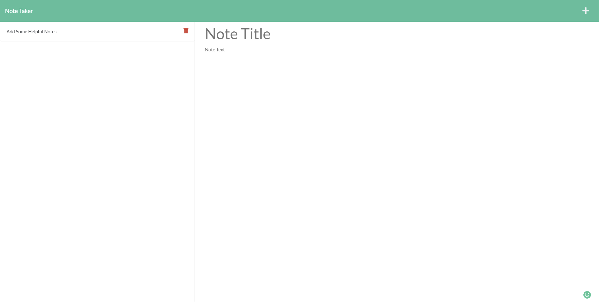

# Note Taker
## Description
Keep track of important information with this Note Taker application. Create, view, and remove different notes with titles and content. The notes are persistant as this is a server deployed application. 

## Table of Contents
* [Usage](#usage)
* [Questions](#questions)

      
* [Credits](#credits)
        
* [License](#license)
        
* [Contributing](#contributing)
        
* [Tests](#tests)
        
    
  

## Usage
At the home page, click on *Get Started* to be navigated to the **Notes** page.   On this page, you'll see a list of existing notes and be able to create new notes.   Click on an existing note to see its information.   Add a new note by adding the *Note Title* and *Note Text*.   Click on the save button to save the new note.   Remove an existing note by clicking on the trash can on the note.

### Screenshot

    

### Link
ADD LINK HERE
    

## Credits
**RESOURCES**   [Node.js](https://nodejs.org/en/)   [Express.js](https://expressjs.com/)   [uniqid](https://www.npmjs.com/package/uniqid)   [Heroku](https://heroku.com/)    **Third-Party Asset**   Front-End HTML, CSS, and JavaScript: https://github.com/coding-boot-camp/miniature-eureka
    

## License

    

## Contributing
This application is not open to outside contribution.

## Tests
There are no test for this applications functionality. 
    
## Questions
For all questions regarding this project, feel free to contact me at:

GitHub: [SirUbu](https://github.com/SirUbu)

Email: thesirubu@gmail.com
